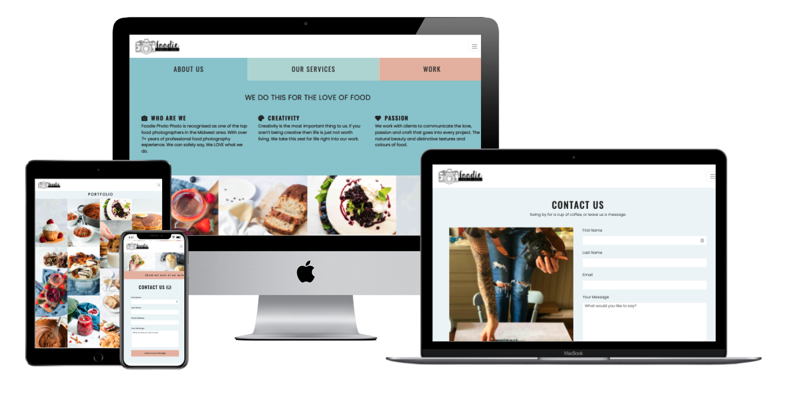
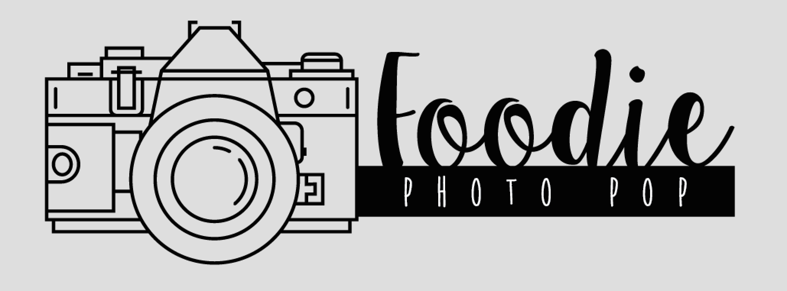

# Foodie Photo Pop

Foodie Photo Pop is a fictional food photography business that provides service of creating high quality. Well it's slightly fictional. I used to run this business a couple years ago when I hired out my photography services. :) 

---

## Table of Contents: 

- [What does it do and what does it need to fulfill?](#what-does-it-do-and-what-does-it-need-to-fulfill)
- [Functionality of Project](#functionality-of-project)
- [User Experience](#user-experience)
  - [User Stories](#user-stories)
  - [Design](#design)
    - [1. Font](#1-font)
    - [2. Color Scheme](#2-color-scheme)
    - [3. Logo](#3-logo)
    - [4. Wireframing & Proposed/Implemented Functionality per Page](#4-wireframing--proposedimplemented-functionality-per-page)
- [Technology Used](#technology-used)
- [Database](#database)
- [Features](#features)
  - [Future Features](#future-features)
- [Testing](#testing)
  - [Found Bugs & Fixes](#found-bugs--fixes)
- [Deployment](#deployment)
- [Credits](#credits)
  - [Special Thanks & Acknowledgements](#special-thanks--acknowledgements)

---

## Welcome to our Foodie Photo Pop Project

    

---

## What does it do and what does it need to fulfill?

The goal of the Foodie Photo Pop project was to have a place that a potential customer can land on and make it easy for them to view the companies work and get in contact with. It's clean design
that puts the portfolio of the photographer front and center. 'Walking the talk' was my thinking for this project. You can see what the work the photographer has done and intrigue the potential customer to reach out asking about services. I specifically left the services information vague so that it would jump start a conversation between the business and potential customer.

This was my first of four Milestone Projects that are a part of the Full Stack Web Development Program at The Code Insitute. That requirements were to make a responsive and static website with a minimum of three pages using HTML and CSS.

[Click here to view the project live](https://maelou363.github.io/foodie_photo_pop/)

### Functionality of Project

[Back to top](#table-of-contents)

# User Experience:

## Main Objectives

To create a seemless experience for the user. Not distracting and allow the photographers photo have their moment and shine. Letting the photographers work doing the speaking for itself.

## User Stories:

_User:_
* As a user I want to be able to quickly see what type of work the photographer has done and be able to easily contact so that I can get the conversation going as soon as possible.
* As a user I'd like the information to be visually appealing and displayed only whats needed so that I can make my decision to hire the company.
* I am a user who primarily uses desktop while looking at potential hires. I want to have a good experience on this website and easily view all the information in an aesthetic smooth way.

_Developer:_
* As a developer I wanted to be able to visually 

# Design

### 1. Font
- Headings - <a href="https://fonts.google.com/specimen/Oswald?preview.text_type=custom">Oswald</a>
- Body - <a href="https://fonts.google.com/specimen/Poppins?preview.text_type=custom">Poppins</a>

### 2. Color Scheme

Our color scheme was created to create a little bit of colour but muted colour scheme around the photos and portfolio work to really give the photos the opportunity to shine and showcase companies work.

-  `#99C9D1` - Primary color
-  `#BAD9D8` - Secondary color
-  `#E3B8A6` - Tertiary color
-  `#F7DED3` - Supplementary color
-  `#EEF5F7` - Supplementary color 2
-  `#7F7F7F` - Supplementary color 2

### 3. Logo

    

## 4. Wireframing & Proposed/Implemented Functionality per Page

Wireframes for this project were created using Affinity Design and Sketch for both mobile and desktop. Each element was structurally planned out before building the project to be sure all elements were accounted for and worked together.

Wireframes

    

    

[Back to Top](#table-of-contents)

# Technology Used

## Languages, Frameworks, Editors & Version Control:

* HTML/CSS ~ core languages used to build this site.
* Bootstrap Framework ~ Pure CSS Component Frontend framework for layout and overall fronend architecture.
* VSCode/Gitpod ~ preferred used editors/IDEs to develop the project.
* Git ~ installed on local machines or default built into Gitpod.
* Github ~ used to host the repository and version control the site, aswell as used for deployment of the project.

## Tools Used:

* W3C HTML Validator / W3C CSS Validator ~ Used to check the validity and efficiency of the code base.
* Font Awesome Icons ~ For iconography not custom to the site.
* Sketch ~ Used to create the wireframes.
* tinypng.com ~ Used to compress images used throughout the site without affecting image integrity/quality.

# Features

[Back to Top](#table-of-contents)

#### Future Features:

* 
* 
* 

# Testing

## Found Bugs & Fixes:

[Back to Top](#table-of-contents)

# Deployment

This application was developed in multiple editors, Gitpod and vsCode, and version controlling was utilised via local (git) and online (github) repository technologies.

Deploying this application was achieved through Github pages by:

* Selecting the Repository from my list in the Github Dashboard.
* Navigating to "Settings" and to the "Github Pages" section.
* From the "Source" section, click on the dropdown and select "main" branch from the associated list.
* Once "main" branch is selected, the page will auto-refresh and navigate the user to the top of the page with a visual ribbon display detailing, "Github pages source saved", indicating the success of the deployment.
* The link to the website can then be found under the "Github Pages" section, with a ribbon notification stating:
    "Your site is published at "https://<username>.github.io/<repo-name>/"

To clone the website:

Select the Repository from the Github Dashboard.
* Click on the "Clone or download" green button located above and to the right of the "Add file" button.
* Click on the "clipboard icon" to the right of the Git URL to copy the web URL of the Clone.
* Open your preferred editor/IDE and navigate to the terminal window.
* Type `git clone <paste-clone-url-here>` and press "Enter/Return" on your keyboard.
* This will create a clone of the project for you.

## Credits / Acknowledgements
* [Code from CSS Script used for dynamic home page tabs](https://www.cssscript.com/create-responsive-tabs-component-using-css-radio-input/)
* All photos used on this website were created by either myself or my friend Katie Chase from The Foodie Movement.

[Back to Top](#table-of-contents)
